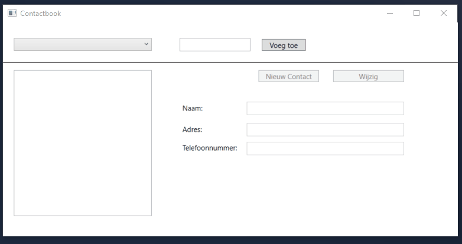
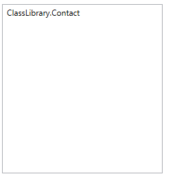
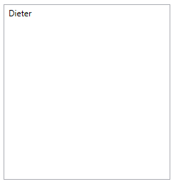

# Opgave: Contactboek

Voor deze uitwerking zullen we een WPF applicatie schrijven waarin we verschillende contactboeken kunnen weergeven. 

## Deel 1: De klassen

In deel 1 zullen we de nodige klassen schrijven. Voeg hiervoor een nieuw "class library" project toe aan je visual studio solution. Hierin gaan we 3 klassen maken.

### De klasse Contact

Deze zal 1 enkel contact voorstellen. Van een contact houden we zijn naam, adres en telefoonnumer bij in 3 properties. Deze 3 eigenschappen moeten opgevraagd en gewijzigd kunnen worden buiten de klasse `Contact`. Zorg er voor dat alle 3 de eigenschappen ingesteld kunnen worden via de constructor.

### De klasse ContactBook

Deze klasse zal 1 enkel contactboek voorstellen en heeft als eigenschappen een naam (bijvoorbeeld `vrienden`, `familie` of `collega's`) die zegt welk soort contacten er in dat contactboek zitten. Daarnaast is er natuurlijk ook nog altijd een eigenschap die de lijst van contacten zelf bevat.

Aan de constructor van deze klasse geef je enkel zijn naam mee (bijvoorbeeld `vrienden`, `familie` of `collega's`). Daarnaast moet er ook een methode voorzien worden waarmee je een contact kunt toevoegen aan het contactenboek.

### De klasse ContactBookApp

Deze klasse omvat de nodige functionaliteiten die we binnen onze applicatie nodig hebben.
Ze omvat een lijst van ContactBooks en de manier om een Contactbook aan de lijst toe te voegen.
Er wordt tevens een methode voorzien die een contact toevoegd aan een contactbook.

## Deel 2: De WPF applicatie

In je WPF applicatie moeten er een paar dingen mogelijk zijn:

- je moet een nieuw contactboek kunnen aanmaken
- je moet de contacten uit een contactboek kunnen weergeven
- je moet een nieuw contact kunnen toevoegen aan een contactboek
- je moet de velden van een bestaand contact kunnen wijzigen (als een persoon verhuist bijvoorbeeld)




## Deel 3: Enkele tips

### Een object in een label, list- of combobox stoppen

Zoals jullie weten, kan je zowat ieder object in een label/combobox/listbox stoppen. Het is dus ook mogelijk om bijvoorbeeld een object van het type Contact in een listbox te steken. Stel dat je de volgende klasse hebt:

```csharp
namespace ClassLibrary
{
    public class Contact
    {

        public string Name {get; set;}

        public Contact(string name)
        {
            Name = name;
        }

    }
}
```

en dat je in je WPF applicatie een listbox hebt met als naam `lstContacts`. Dan kun je het volgende statement uitvoeren.

```csharp
Contact dieter = new Contact("Dieter")
lstContacts.Items.Add(dieter)
```

Dan ga je het volgende krijgen in je WPF applicatie:



Je ziet dus de naam van de klasse verschijnen in je listbox. Om dat te vermijden kun je de klasse `Contact` als volgt aanpassen:

```csharp
namespace ClassLibrary
{
    public class Contact
    {

        public string Name {get; set;}

        public Person(string name)
        {
            Name = name;
        }

        public override string ToString()
        {
            return Name;
        }

    }
}
```

Door de `ToString` methode toe te voegen (let ook op het gebruik van het `override` keyword) zal onze listbox er nu als volgt uitzien.



Je hebt nog altijd een object van het type Contact in de listbox gestopt, maar achter de schermen zal c# de `ToString()` methode gebruiken om te beslissen hoe hij het Contact object zal weergeven in de listbox.

Het leuke aan een object in een listbox steken is dat je het er ook gewoon kan uithalen

```csharp
Contact selected = (Contact) lstContacts.SelectedItem;
```

En dit zal het object van het type Contact teruggeven dat momenteel geselecteerd is in de listbox. 

Vergeet niet om wat rechts staat te casten naar een Contact via `(Contact)`. Het is namelijk zo dat `lstContacts.SelectedItem` niet weet wat het type van het geselecteerde item is. En daardoor kan je het niet zomaar in een object van het type Contact stoppen (net zoals je geen string in een int kunt stoppen).

 Maar aangezien wij zelf een object van het type Contact in de listbox hebben ingestopt, weten wij als programmeur wel dat het geselecteerde item het type Contact heeft. Dus mogen we die cast doen en tegen c# zeggen dat het een object van het type Contact is.

 ### Een lijst koppelen aan een list- of combobox

 Bij deze oefening zal het nuttig zijn om ervoor te zorgen dat de inhoud van een list- of combobox overeen komt met de inhoud van een lijst. Dit kun je heel makkelijk als volgt doen:

 ```csharp
List<Contact> contacts = new List<Contact>() {new Contact("Dieter"), new Contact("Maxim")};
lstContacts.ItemsSource = contacts;
 ```
Door de ItemsSource in te stellen weet je listbox dat hij om zijn inhoud te bekijken moet kijken naar de lijst contacts. Iedere keer je dan

```csharp
lstContacts.Items.Refresh();
```

doet zal er gekeken worden naar wat er op dat moment in de lijst `contacts` zit en zal ervoor gezorgd worden dat de inhoud van de listbox terug matcht met de inhoud van de lijst.

## Deel 4: Uitbreidingen

Voorzie de volgende foutcontrole en zorg ervoor dat de gebruiker gepaste feedback krijgt (via bijvoorbeeld een messagebox):

- De naam, adres en het telefoonnummer mag niet leeg zijn
- Je kan geen twee contactboeken met dezelfde naam toevoegen
- Je kan geen twee contacten met dezelfde naam aan hetzelfde contactboek toevoegen
- De naam van een contact mag enkel uit letters/spaties bestaan
